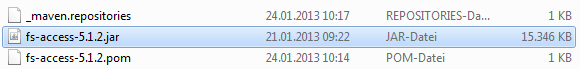

# FS Test Tools

This is a project to support FirstSpirit module developers with writing unit tests for FirstSpirit components. 
It can help you testing your executeables, services, runnable gui elements and the  deployment descriptors by providing an easy way to get handy mock objects. 

## Getting started

### Getting it
To get the FS Test Tools, you can choose between two options:

#### Option 1: Use The Binary Release
Get the [GitHub release](https://github.com/e-Spirit/FSTestTools/releases) and install it. Use this command to make sure maven installs the jars correctly*:
 
```
mvn install:install-file -Dfile=<path-to-file> -DpomFile=<path-to-pomfile-of-file>
```

For version _1.2.3_ the complete installation would look like this:

```
mvn install:install-file -Dfile=mocking-1.2.3.jar -DpomFile=mocking-1.2.3.pom
mvn install:install-file -Dfile=rules-1.2.3.jar -DpomFile=rules-1.2.3.pom
mvn install:install-file -Dfile=tests-1.2.3.jar -DpomFile=test-1.2.3.pom
```

\* See [official Maven mini guide](https://maven.apache.org/guides/mini/guide-3rd-party-jars-local.html) for more information.


#### Option 2: Building It From Source
Building from source is quiet easy. Just clone the project and build the _FirstSpirit Test Tools parent_.
To do this, just execute the following command:

```shell
mvn clean install -Dci.version=<your-version>
```
The build will create the following artifacts:

* mocking-_Your-Version_.jar
* rules-_Your-Version_.jar
* tests-_Your-Version_.jar

With `-Dci.version=<your-version>` you can change the version you are building. By default, the version is _1.0_DEV.123_. Feel free to change it.

		
### Including it
After installation, you can add the dependencies inside your own project's pom.xml (e.g. for the _mocking_ artifact). You can replace _Your-Version_ with _LATEST_ if you have access to e-Spirit's artifactory.

```xml
	...
	<dependencies>
		...
		<dependency>
			<groupId>com.espirit.moddev.fstesttools</groupId>
			<artifactId>mocking</artifactId>
			<version>Your-Version</version>
			<scope>test</scope>
		</dependency>
		...
	</dependencies>
	...
```

		
		
## Usage
You are now ready to use the _FS Test Tools_. This section will show you how to correctly do that.

### Using Mocking Contexts
The following example will show you how to use a _MockingBaseContext_ inside your own unit test.
Other mock context classes work similar to this. See Javadoc for further information about each context.  

```java
public class MyTest {
    ...
    private BaseContext context;

    @Before
    public void setUp() throws Exception {
        context = new MockingBaseContext(Locale.ENGLISH, BaseContext.Env.PREVIEW);
        ...
    }
    
    @Test
    public void testSomething() throws Execption {
        // Use normal FS API to get mocks of classes such as agents:
        FormAgent formAgent = context.requireSpecialist(FormAgent.TYPE);
        // Use Mockito to tell what the mock should do
        when(formAgent.anyMethod()).thenReturn(...);
        ...
    }
    ...
}
```


### Using The JUnit Rules
For this section, you need to know a little bit about JUnit rules.
If you are not familiar with _JUnit Rules_, have a look at [this](https://github.com/junit-team/junit4/wiki/rules).
At the moment there are only two types of custom Junit Rules available:

* Two rules to support you with logging
* One rule to support you with FirstSpirit client actions


#### Logging Rules
Logging rules can help you with managing your logging. They are usefull if there are many log lines and it is needed to know where a test starts and stops. 
If both logging rules are used, then the logging system is initialized (_InitLog4jLoggingRule_) and in the log there is a message at the beginning and at the end of each test (_LogTestMethodNameRule_).
The example shows how you can use the rules:

```java
public class MyTest {
    
    @ClassRule
    public static InitLog4jLoggingRule loggingRule = new InitLog4jLoggingRule();
    
    @Rule
    public LogTestMethodNameRule rule = new LogTestMethodNameRule();
    
    @Test
    public void testSomething() throws Execption {
        
        ...
    }
    ...
}
```

Example log output:
```
1 [main] INFO MyTest  - Start of 'testSomething'...
...
5 [main] INFO MyTest  - Successful termination of 'testSomething'!
```


#### FirstSpirit Connection Rule
The FirstSpirit Connection Rule is a FirstSpirit client for integration tests.
The rule maintains the connection, e.g. opens and close it according to test life cycle.
The prerequisite is a running FirstSpirit server.
By default the host `localhost` with port `8000` and user `Admin` with password `Admin` is used.
Then the rule can be used to execute a schedule, import zips (e.g. exported templates) or modify the content of templates.
The feature set of the rule is not final or complete but can be extended easliy.
If you like to have some new functionality you are welcome to provide it by adding a so-called command (see paragraph below).
This example starts a connection to a FirstSpirit server and invokes a command:

```java
public class MyTest {
    
    @Rule
    public FirstSpiritConnectionRule rule = new FirstSpiritConnectionRule();
    
    @Test
    public void testSomeThing() throws Execption {
        MyParameters parameters = new MyParameters(...);
        MyResult result = rule.invokeCommand("nameOfCommand", parameters);
        ...
    }
    ...
}
```

All available commands can be found in the package [com.espirit.moddev.fstesttools.rules.firstspirit.commands](rules/src/main/java/com/espirit/moddev/fstesttools/rules/firstspirit/commands).

#### Create Your Own FirstSpirit Connection Rule Commands

As mentioned above, it is not that hard to write your own commands. Basically you only need to implement three interfaces (`FsConnRuleCmdParamBean`, `FsConnRuleCmdResultBean` and `FsConnRuleCommand`) where the command class must be in the package `com.espirit.moddev.fstesttools.rules.firstspirit.commands` or below (the rule will scan for commands):

```java
public class MyParameters implements FsConnRuleCmdParamBean {
    
    @javax.inject.Inject
    private Connection firstSpiritConnection;
    
    // Or:
    //@Inject
    //private BaseContext baseContext;
    
    // Or:
    //@Inject
    //private SpecialistBroker broker;
    
    ...

    @Override
    public String getProjectName() {
        //If no project is needed return here null
        return null;
    }

    ...
}

public class MyResult implements FsConnRuleCmdResultBean {
    ...
}

public class MyCommand implements FsConnRuleCommand<MyParameters, MyResult>{
    
    @Override
    public String name() {
        return "Foobar";
    }

    @Override
    public MyResult execute(final MyParameters parameters) {
        ...
        return new MyResult(...);
    }
}
```

With *dependency injection* (see [JSR 330](https://www.jcp.org/en/jsr/detail?id=330) or `@javax.inject.Inject` annotation above) the FirstSpirit Connection Rule will provide a `Connection`, a `BaseContext`, a `SpecialistBroker` or a `GenerationContext` which will be the foundation of your command.

### Using The Module-Xml-Test

[//]: <> (Write a short abstract about module-xml testing)

[//]: <> (re-read this section)

The parent class `AbstractModuleXmlTest` expects a `module.xml` in the root of the class path.
Futhermore there must be a file called `moduleXmlTest.properties` in the test resource which must be filtered too:

```ini
name=${project.groupId}.${project.artifactId}
displayName=${project.name}
description=${project.name} (${project.artifactId})
version=${project.version}
vendor=${organization.name}
```

If the pom's variables or properties do not apply at your project because you use static strings then use static values inside the `moduleXmlTest.properties`.
The basic idea behind the pom's variables is to have one place to maintain a module's name, display name etc.
To enable filtering just add this to your `pom.xml`:

```xml
<project>
    ...
    <build>
        <testResources>
            <testResource>
                <directory>src/test/resources</directory>
                <filtering>true</filtering>
                <includes>
                    <include>*.properties</include>
                </includes>
            </testResource>
            <testResource>
                <directory>src/test/resources</directory>
                <filtering>false</filtering>
                <excludes>
                    <exclude>*.properties</exclude>
                </excludes>
            </testResource>
        </testResources>
        ...
    </build>
    ...
</project>
```

After this you need to subclass the `AbstractModuleXmlTest` with a `ModuleXmlTest` and implement the class loader method:

```java
public class ModuleXmlTest extends AbstractModuleXmlTest {

    @Override
    protected ClassLoader getTestClassLoader() {
        return getClass().getClassLoader();
    }

    // Additional Tests are possible, for instance
    @Test
    public void testThatConstanceValuesEqualsNamesInModuleXml() throws Exception {
        assertThat("Expected specific value", getModuleXML(),
                   hasXPath("/module/components/project-app/name", equalTo("MyTechnicalProjectAppName")));

    }
}
```
When you have done this you get some basic tests for free:

* Name
* Display name
* Version
* Vendor
* Existance of full qualified class names of class and configurable XML tags

Of cause you can add some own test cases as you like by using the Hamcrest XPath Matchers (see above).


	
	
	
## Getting Help
If you need help, please read this section. It provides a subsection for troubleshooting and a subsection with examples which may be handy in some cases. If you want to contribute, please read the contribution section below. 
If there are any further questions regarding the *FS Test Tools* please go to the [FirstSpirit Community Developers Section](https://community.e-spirit.com/community/developer) and post them there.


### Troubleshooting

[//]: <> (f.a.q. answers, common problems etc.)

#### Use FirstSpirit Access API As Maven Dependency

If you are getting an error that the dependency `fs-access` could not be resolved then please follow the instructions below.
To enable the source code to be compiled successfully, the `fs-access.jar file of the FirstSpirit Server used must be installed in the local Maven repository first. The **fs-access.jar** file is located in the directory:

```
<FirstSpirit Server directory>/data/fslib
```

It is installed by entering the following command into the command line:

```
mvn install:install-file -Dfile=<path-to-access.jar> -DgroupId=de.espirit.firstspirit -DartifactId=fs-access -Dversion=<fs version e.g. '5.0.0'> -Dpackaging=jar
```

Within this command, the parameters for the path to the **fs-access.jar** file and the FirstSpirit version used must be substituted accordingly:

```
mvn install:install-file -Dfile=C:\fs-access.jar -DgroupId=de.espirit.firstspirit -DartifactId=fs-access -Dversion=5.1.2 -Dpackaging=jar
```

**Note:** *Running the installation command within the directory in which the **pom.xml** file has been saved leads to an error. The installation must therefore be performed outside this directory.*

During installation, the local Maven repository has been automatically created in the user directory under **<user's home>.m2/repository**. After the **fs-access.jar** file has been successfully installed, it should be located in this directory (see figure below):




### Examples

There is a dedicated [sub module](examples) with code examples in this Maven project.
The unit tests can be executed with Maven. The next paragraphes discuss the examples more in detail.

#### FirstSpirit Deployment Descrptor (module.xml)

Each FirstSpirit module must have a deployment descriptor called `module.xml` which tells FirstSpirit what to expect inside the FirstSpirit module file (*.fsm).
To avoid careless mistakes by developers and ensure a certain formalism, it can be brought under test by a simple unit test.
In detail this is discussed under [Using The Module-Xml-Test](#using-the-module-xml-test).
The example unit test is called  [ModuleXmlTest](examples/src/test/java/com/espirit/moddev/fstesttools/examples/ModuleXmlTest.java).
The unit test checks for standard tags like name, version etc. as well as full qualified class names.

#### FirstSpirit Executable

This example shows how to write a unit test with a [MockingBaseContext](mocking/src/main/java/com/espirit/moddev/fstesttools/mocking/MockingBaseContext.java) for an FirstSpirit executable Java class called [MyExecutables](examples/src/main/java/com/espirit/moddev/fstesttools/examples/MyExecutable.java).
The use case is quite simple, it shows a yes/no dialog to user for both clients, ContentCreator (web) and SiteArchitect (UI).
The corresponding unit test for this FirstSpirit Executables is [MyExecutablesTest](examples/src/test/java/com/espirit/moddev/fstesttools/examples/MyExecutableTest.java).
It simulates both FirstSpirit clients ContentCreator and SiteArchitect with two languages.

#### FirstSpirit Service

The next example deals about FirstSpirit serverside services and implements a function to retrieve the FirstSpirit version string.
Again, the [MockingBaseContext](mocking/src/main/java/com/espirit/moddev/fstesttools/mocking/MockingBaseContext.java) plays a central role. 
The service implementation class [MyServiceIml](examples/src/main/java/com/espirit/moddev/fstesttools/examples/MyServiceIml.java) implements the Java interfaces [MyService](examples/src/main/java/com/espirit/moddev/fstesttools/examples/MyService.java) and [Service\<MyService\>](http://www.e-spirit.com/odfs52/dev/de/espirit/firstspirit/module/Service.html) ([FirstSpirit Community](https://community.e-spirit.com) for login information)
The unit test is called [MyServiceImlTest](examples/src/test/java/com/espirit/moddev/fstesttools/examples/MyServiceImplTest.java).

#### FirstSpirit UI Action Items

Besides the more general FirstSpirit Executables there are toolbar buttons or context menu items to extend the FirstSpirit clients with own functionality.
Here as well, the [MockingBaseContext](mocking/src/main/java/com/espirit/moddev/fstesttools/mocking/MockingBaseContext.java) plays a central role. 
There are two examples, a toobar item called [MyToolbarItem](examples/src/main/java/com/espirit/moddev/fstesttools/examples/MyToolbarItem.java) and a context menu item called [MyContextMenuItem](examples/src/main/java/com/espirit/moddev/fstesttools/examples/MyContextMenuItem.java).
Both implementation show the current selection or item under focus.
The correponding untit tests are [MyToolbarItemTest](examples/src/test/java/com/espirit/moddev/fstesttools/examples/MyToolbarItemTest.java) and [MyContextMenuItemTest](examples/src/test/java/com/espirit/moddev/fstesttools/examples/MyContextMenuItemTest.java).


## Third Party Dependencies

The FirstSpirit Test Tools are built with [Maven](https://maven.apache.org/) and compiled against the following libraies:

### Runtime Dependencies
* [FirstSpirit Access API](http://www.e-spirit.com/firstspirit)
* [JSR 330 (javax.inject)](https://www.jcp.org/en/jsr/detail?id=330)
* [JUnit 4](http://junit.org/)
* [Hamcrest](http://hamcrest.org/JavaHamcrest/)
* [Mockito](http://site.mockito.org/)
* [Reflections](https://github.com/ronmamo/reflections)
* [Apache Commons IO](https://commons.apache.org/proper/commons-io/)
* [Apache Log4J 1.2](https://logging.apache.org/log4j/1.2/)
* [SLF4J API](https://www.slf4j.org/)

### Test Dependencies
* [Needle4J](http://www.needle4j.org/)	

## More Information
[//]: <> (reread this section)
Regarding unit test philosophy the `MockingBaseContext` is a [fake](https://www.martinfowler.com/articles/mocksArentStubs.html) which produces [mocks](https://www.martinfowler.com/articles/mocksArentStubs.html) (of agent or service implementations) with the help of the [Mockito](http://site.mockito.org/) library.
So it acts as a test drop-in replacement for the real FirstSpirit `BaseContext` and its decendants.
But it is not only a simple mock factory because it returns always the same mock object instance by using FirstSpirit API calls.
So the mocks are always [singletons](https://en.wikipedia.org/wiki/Singleton_pattern) for the current test.

## Dislaimer 

FirstSpirit and this project are developed by the [e-Spirit AG](http://www.e-spirit.com).
The head office of the e-Spirit AG is in Dortmund, Germany.

Use this project and provided binaries at your own risk.

### License
Apache License Version 2.0 
January 2004
[http://www.apache.org/licenses/](http://www.apache.org/licenses/)

